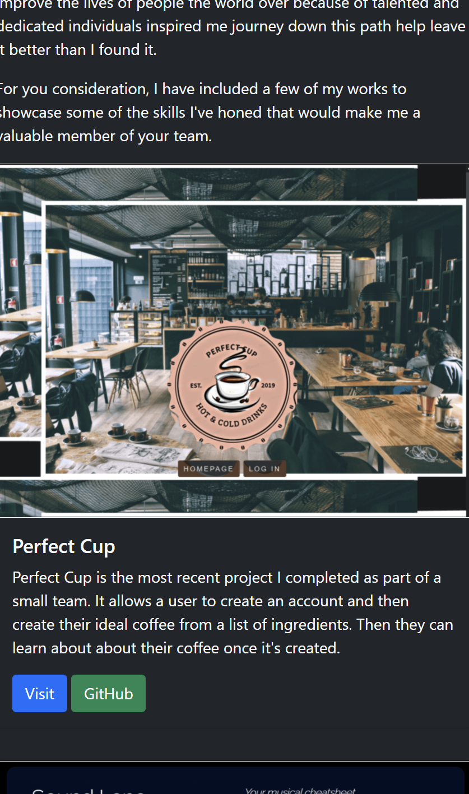
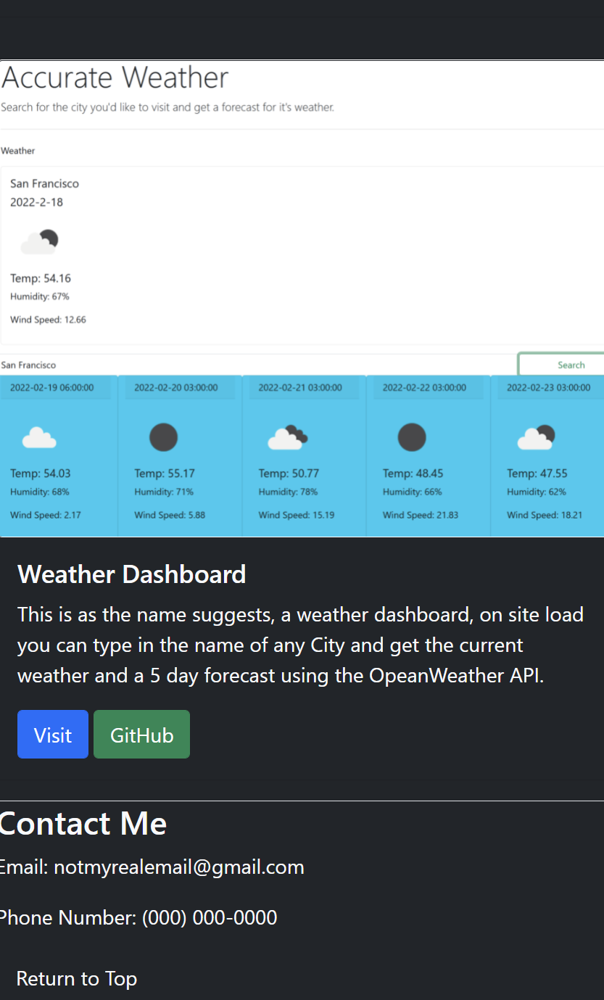
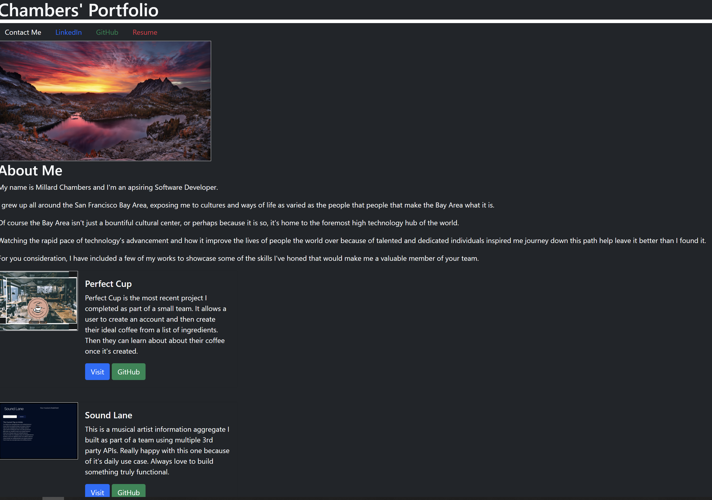
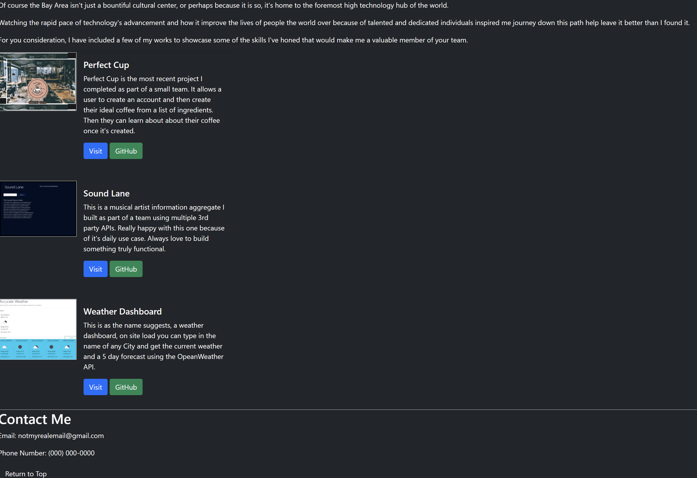

# Professional Portfolio 3

This is my third take on a professional portfolio, the site has a handful of the projects I've worked on that I'm proud of along with links to my linkedIn page, GitHub and Resume pdf.

The styling was thanks to Bootstrap a popular CSS framework I'm fond of.

I prefer a minimalist design that gets straight to the point though I may reconsider in the future as I'm still fond of my original portfolio's design. As of now, the color serves only to differentiate the elements on the page albeit tastefully.

The site is also mobile first, I believe it's layout serves the small screen space well.

Link: https://mchambersiv.github.io/professional-portfolio-v3/

## Mobile Screenshots
This is the page at load on mobile

These are the projects as they appear on mobile.

Lastly, the bottom of the page.

## Desktop Screenshots

The page on load on a Desktop

The bottom of the page
